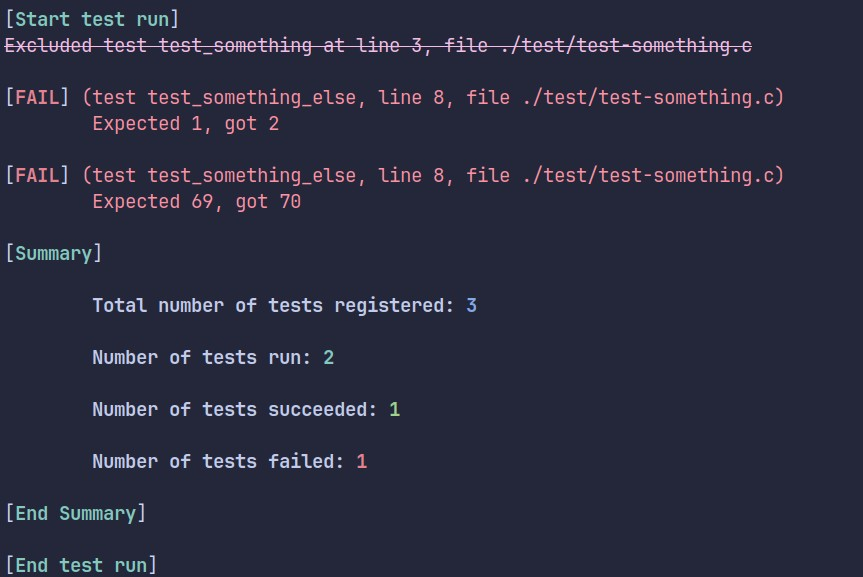
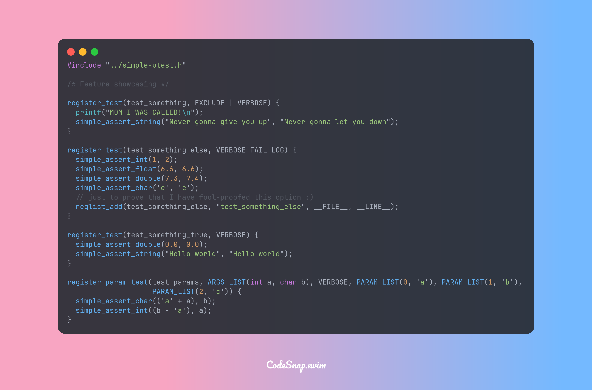

# Simple Unit Test
> A straightforward unit test utility for the C language




---
### Disclaimer
- This is mainly designed for Linux.
    - If you're on MacOS or any POSIX-compliant OS, you probably still can use this well
    - If you're on Windows, I have bad news for you
- Due to the use of `__attribute__` and `0b` in the code, this is only compatible with compilers that support such features (`gcc`, `clang`, and perhaps more)
- Well, technically also a convenient utility for my _other, left-behind_ project.
- If you want something that is as straightforward but much more featureful, check out [Criterion](https://github.com/Snaipe/Criterion). This, for now, is meant for my learning this language.
- Due to the design of this utility, running tests concurrently or multi-threadedly is very difficult. You can still spawn threads and run your program however, just be sure that what is passed into assertions is the final result of the multi-thread process.
---
### Installation: build from source
- Make sure you have `clang` (version 17 or higher) installed. (Older versions may work but it's not a guarantee) (`gcc` will work as well, but will need a tiny extra step)
- Clone this repo and build
```
git clone https://github.com/nguyenhuy0905/simple-utest.git
cd ./simple-utest
# if you only want to build the library
make 
# or make CC=gcc if you use gcc
# or make CC=gcc OPTS=-g if you want to include debug flags 
# for the library (which is only necessary if you need to test out the library)
```
- Optionally, to compile and run [the demo files](./test/), run this command instead:
```
make test
# or make test OPTS=-g if you want to include debug flags 
# in the library and the test
```
---
### Installation: download package
- [Download a release binary here](https://github.com/nguyenhuy0905/simple-utest/releases), preferably the latest release. Note: as of now, the releases are not ready for "_professional_" use.
- Unzip to the directory of the project you would like to write tests on, (optionally,) rename the folder to `simple-utest`.
    - If you really really enjoy using this, you can [add the directory to PATH](https://phoenixnap.com/kb/linux-add-to-path).
---
### How to use
- [Check out the example Makefile](./Maketest.example.mk)
- Documentation coming soon. Sorry :(
- To use in your C file/header:
```
/* simply include it */
#include "/path/to/simple-utest/simple-utest.h"
```
- Then, when compiling:
```
# or gcc
clang -o your-test-executable your-file-name.c -L/path/to/simple-utest/ -lsimple-utest
```
- To execute the test file:
```
LD_LIBRARY_PATH=${LD_LIBRARY_PATH}:/path/to/simple-utest/ /path/to/your-test-executable
```
- You can combine a few test files into one test executable to better utilize the 128 max-test cap.
    - If you choose to do so, make sure that no function has the same name.
    - This is necessary if for some reason, you want to write more than about 65000 lines of test.
    - [You can check the demo Makefile to see how to combine tests](./Maketest.example.mk)
- Or, of course, you can just combine each test file as its own executable.
---
### Plans
- [ ] Write some documentation
- [x] Release a binary package
- [ ] Allow user-defined assertion
- ~[ ] Add inline data "syntax sugar"~
- [x] Implement parameterized tests
- [ ] Give option to write test results to a log file
### Issues
- [ ] Float or double assertions returning wrong results, especially if . This is due to how the variable types work. I will modify the method to request for degree of precision.
### Changelog
- I'm lazy. Just [check the Releases page](https://github.com/nguyenhuy0905/simple-utest/releases).
