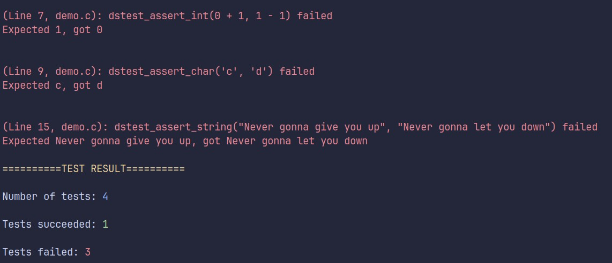

# Dead Simple Test
> A declarative, kind-of straightforward collection of macros for unit testing your C code
---

---
### What's this?
- As of now, it's simply a bunch of header defines to make unit-testing your code easier.
- Provide test logging and summary.
- You can also `#define` your own test macro if you'd like to.
- [A demo test file is included](./demo/demo.c).
---
### Note
- This project is in its early phases. 
    - Expect more features to come!
- Since this test utility is just a bunch of macros
    - There are certain conventions that you have to follow.
    - Some of which may not be the most logical.
- Despite its name, this is not super simple to use
    - You do have to write a good amount of boilerplate code, like `dstest_begin_run()` and `dstest_end_run()` at the end of the test file.
    - Or `dstest_begin_declare(testname)` and `dstest_end_declare(testname)` inside a test area.
    - Then you have to list all tests to run using `dstest_run(testname)`
- If you're in source codes of headers (except `dead-simple-test.h`), your LSP may note you about an error. That is totally fine though. Everything still runs perfectly fine if in your code file, you only include `dead-simple-test.h`
### Plans
- [ ] Write some documentation.
- [ ] Think of a way to fix log fail exclusion option
